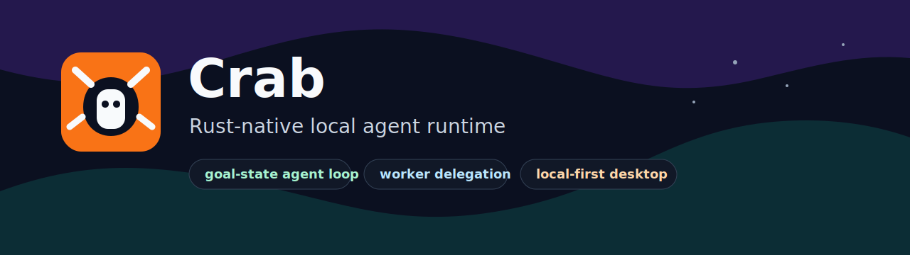
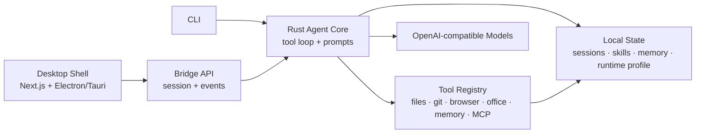
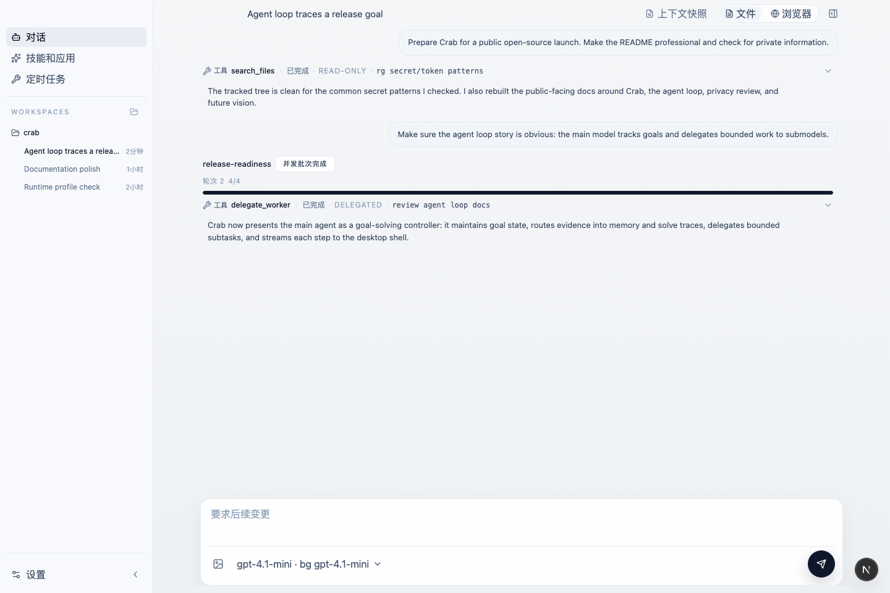
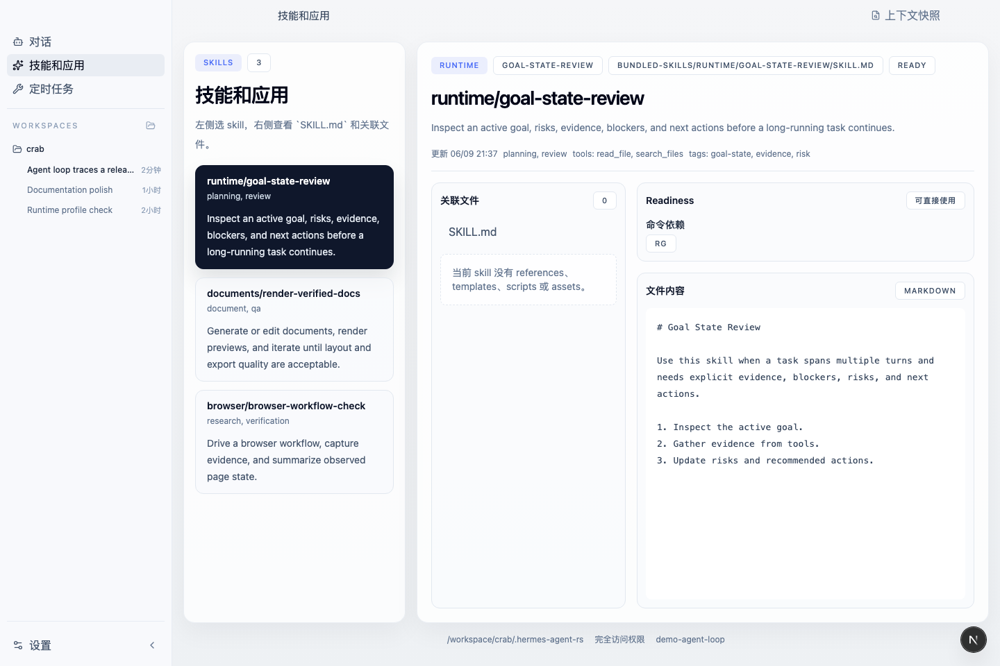
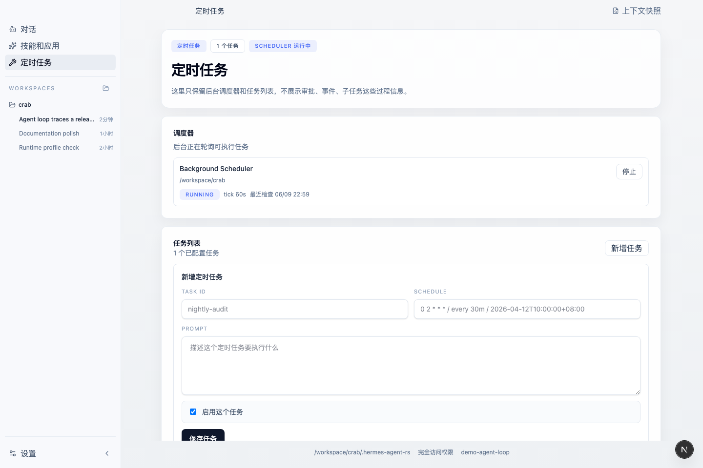
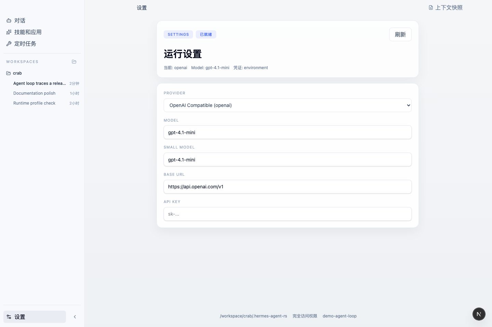

# Crab

[简体中文](README.zh-CN.md)



<p>
  <a href="https://github.com/matingai/crab/stargazers"></a>
  <a href=".github/workflows/ci.yml"></a>
  <a href="LICENSE"></a>
  <a href="https://github.com/matingai/crab/commits/main"></a>
  <a href="https://github.com/matingai/crab/issues"></a>
  <a href="CONTRIBUTING.md"></a>
  <a href="Cargo.toml"></a>
  <a href="#status"></a>
  <a href="docs/AGENT_LOOP.md"></a>
  <a href="docs/AGENT_LOOP.md#delegation-model"></a>
  <a href="docs/ARCHITECTURE.md#local-state"></a>
  <a href="#desktop-shell"></a>
  <a href="#configuration"></a>
  <a href="SECURITY.md"></a>
  <a href="ROADMAP.md"></a>
</p>

Crab (Chinese name: 螃蟹) is an experimental Rust agent runtime and desktop shell inspired by
[NousResearch/hermes-agent](https://github.com/NousResearch/hermes-agent). It is not a
line-by-line port. The project focuses on a reusable local agent core, an explicit tool
registry, persistent workspace state, and desktop integration through Electron or Tauri.

The current codebase is best treated as an active 0.1.x prototype for people who want to
study, extend, or embed a local coding/research agent in Rust.

## What Makes It Different

Crab is built around a local runtime rather than a single chat UI. The CLI,
desktop shell, tools, memory, skills, and bridge APIs all sit on top of the same Rust core,
so the project can be used as a standalone assistant, a desktop app backend, or an
embedding target for other local automation surfaces.

Key project characteristics:

- **Rust-native agent core**: the tool loop, model client, session persistence, event
  stream, and runtime configuration live in Rust instead of being thin wrappers around a
  script.
- **Event-first desktop integration**: agent execution emits structured lifecycle,
  streaming, tool, approval, and completion events that a UI can subscribe to directly.
- **Workspace-aware context**: project instructions, subdirectory hints, session state,
  memories, skills, todos, and local runtime profiles are assembled as first-class prompt
  inputs.
- **Goal-state centered reasoning**: the main agent tracks the active goal, blockers,
  evidence, risks, next actions, and confidence instead of treating each prompt as an
  isolated chat turn.
- **Tools as a governed registry**: built-in tools expose schemas, execution boundaries,
  approval hooks, and condensed model-facing definitions instead of relying on arbitrary
  shell access.
- **Delegation-oriented execution**: the main loop can hand bounded research,
  verification, implementation, and document-generation work to delegated workers or
  auxiliary models, then merge their findings back into the goal state.
- **Local knowledge loop**: skills and memory are treated as reusable agent capabilities,
  not just passive notes or UI-side metadata.
- **Document and browser workflows**: the runtime includes browser automation, PDF
  inspection, Office document handling, and Slidev deck support, which makes it useful for
  research and office-style agent workflows as well as coding.
- **Desktop shell without lock-in**: Electron is available for the current shell, while the
  bridge and Tauri scaffolding keep the backend independent from a single frontend runtime.

## Highlights

- OpenAI-compatible model client with Responses API and Chat Completions support.
- Streaming event model for UI integrations and desktop shells.
- Tool-calling loop with workspace-scoped file, Git, browser, PDF, Office, memory, skill,
  MCP, cron, and delegation tools.
- Local session persistence under the current compatibility data directory,
  `.hermes-agent-rs/`.
- Project context injection from files such as `AGENTS.md`, `CLAUDE.md`, `.hermes.md`,
  `.cursorrules`, and `.cursor/rules/*.mdc`, with directory-specific instruction stacks
  discovered as tools touch nested paths.
- Local memory and skills systems designed for per-turn recall instead of dumping the
  entire history into every request.
- Context compression and request recovery paths for long-running sessions.
- A desktop shell built with Next.js plus Electron, with a Tauri backend skeleton kept in
  the repository for native integration work.
- Runtime profile inspection for browser and Office-related capabilities.

## Architecture At A Glance



## Screenshots

The screenshots below use demo data generated by `scripts/capture-screenshots.mjs`.

| Agent Timeline | Skills And Apps |
| --- | --- |
|  |  |

| Scheduler | Runtime Settings |
| --- | --- |
|  |  |

## Further Reading

- [Project Overview](docs/PROJECT_OVERVIEW.md): product and engineering thesis.
- [Architecture](docs/ARCHITECTURE.md): runtime, bridge, tools, desktop shell, and local
  state.
- [Agent Loop](docs/AGENT_LOOP.md): goal-state reasoning, delegation, tool evidence, and
  recovery.
- [Install Guide](docs/INSTALL.md): source installation, `cargo install`, provider setup,
  and desktop shell startup.
- [Quickstart](docs/QUICKSTART.md): the shortest path from install to doctor, no-key
  smoke test, model-backed prompt, and desktop preview.
- [Examples](examples/README.md): demo-ready coding, research, browser/PDF, and document
  workflows.
- [FAQ](docs/FAQ.md): no-key demo path, model gateways, safety notes, and common
  launch questions.
- [Demo Script](docs/DEMO_SCRIPT.md): a short recording/live-demo script.
- [Launch Kit](docs/LAUNCH_KIT.md): positioning, launch posts, article outlines, and
  release-day checklist.
- [Promotion Playbook](docs/PROMOTION_PLAYBOOK.md): launch sequence, channel playbooks,
  social copy, metrics, and objection handling.
- [Future Vision](docs/FUTURE_VISION.md): long-term roadmap and product direction.
- [Open-source Privacy Review](docs/OPEN_SOURCE_REVIEW.md): privacy and repository hygiene
  before publication.
- [Badges And Topics](docs/BADGES_AND_TOPICS.md): repository tags, labels, badges, and
  social-preview guidance.
- [Release Process](docs/RELEASE_PROCESS.md): release checklist and versioning notes.
- [Maintainer Guide](docs/MAINTAINER_GUIDE.md): triage, positioning, labels, and public
  hygiene.

## Repository Topics

Recommended GitHub topics:

`rust` · `ai-agent` · `agent-runtime` · `agent-loop` · `tool-calling` · `local-first` ·
`desktop-agent` · `electron` · `tauri` · `openai-compatible` · `mcp` · `automation` ·
`developer-tools`

## Agent Loop Design

The agent loop is the center of the project. Crab treats the main agent as a
goal-solving control model rather than a single request-response wrapper around an LLM.
Its job is to keep track of the user's objective, maintain a compact working state,
choose the next meaningful action, delegate bounded work when useful, and integrate the
results back into the active goal.

Each turn is handled as a controlled execution cycle that can assemble context, call
tools, update local state, recover from model/runtime limits, and stream structured
progress back to the UI.

The loop is designed around these ideas:

- **Goal tracking first**: the loop maintains goal state, blockers, evidence, confidence,
  risks, hot data, todos, and solve traces so it can reason about progress across many
  turns instead of restarting from the latest prompt.
- **Main agent as orchestrator**: the primary model focuses on task framing, next-step
  selection, tradeoff judgment, approval boundaries, and result synthesis.
- **Delegation to submodels/workers**: bounded subtasks such as code exploration,
  verification, document drafting, browser research, or alternative solution search can be
  delegated to worker runs or auxiliary models, then read back and reconciled.
- **Context before action**: each turn rebuilds the model input from project instructions,
  recent conversation history, recalled memory, active skills, todos, goal state, runtime
  profile, and optional debug/context modules. Directory-specific instruction files are
  injected root-to-leaf as tools enter nested paths, so more specific rules arrive with
  clear precedence.
- **Tool use as a protocol**: tools expose schemas and return observations that are
  summarized, classified, and folded back into the conversation, goal state, memory, and
  solve trace instead of being appended as unbounded raw logs.
- **Stateful progress tracking**: sessions, memory, todos, goal state, solve traces,
  archive records, approvals, and delegated runs are persisted locally so long tasks can
  continue across turns and desktop restarts.
- **Approval-aware execution**: sensitive operations can pause for approval and later
  resume through the same session/event path. Terminal commands and `execute_code`
  snippets share the same destructive shell-risk checks.
- **Configurable tool policy**: local config can require approval for selected tools or
  disable tools entirely, with exact names, prefix patterns such as `browser_*`, and
  path-scoped rules for sensitive files.
- **Dirty-worktree protection**: file mutation tools refuse to overwrite, patch, delete,
  or move existing Git paths with uncommitted changes unless the tool call explicitly opts
  into `allow_dirty`.
- **Context pressure handling**: the loop can detect context overflows, compress older
  history, adjust output budgets, and retry with a safer prompt shape.
- **Event streaming as a first-class output**: the loop emits model, tool, approval,
  delegation, context, and completion events, which lets the desktop shell render a live
  execution timeline instead of waiting for a final string.
- **Extensible execution surface**: the built-in registry, MCP tools, plugin hooks,
  bundled skills, and delegation tools all plug into the same loop instead of living as
  separate one-off integrations.

## Status

This repository is under active development. Public APIs, desktop shell behavior, tool
schemas, and local data formats may change before a stable release.

Important safety notes:

- The terminal tool is disabled by default. Enable it explicitly with `--enable-shell` or
  `HERMES_RS_ENABLE_SHELL=1`.
- Browser, file, Office, and shell-related tools operate on the local machine. Use a
  trusted workspace and review model outputs before approving sensitive actions.
- `execute_code` is also gated by shell access and pauses for approval when inline or
  file-backed scripts contain obvious destructive shell fragments.
- Local `tool_policy` can protect sensitive paths such as `.env*` or
  `.github/workflows/*` before any matching tool implementation runs.
- In Git workspaces, file mutation tools protect existing paths with uncommitted changes
  by default. Use an explicit `allow_dirty` tool argument only when intentionally modifying
  local user changes.
- Local sessions, memory, logs, runtime databases, and provider configuration belong in
  ignored local directories. Do not commit `.hermes-agent-rs/`, `.env`, generated decks,
  generated documents, or browser/session artifacts.

## Repository Layout

```text
.
├── src/                         Rust agent runtime and CLI
│   ├── agent.rs                 Tool-calling loop and session execution
│   ├── bridge.rs                Frontend/desktop bridge API
│   ├── cli.rs                   Command-line interface definitions
│   ├── config.rs                Runtime configuration loading
│   ├── llm.rs                   OpenAI-compatible model client
│   ├── prompts.rs               System prompt and workspace context assembly
│   ├── runtime_profile.rs       Local runtime capability resolution
│   ├── skills.rs                Local skill discovery and storage
│   └── tools/                   Built-in tool implementations
├── bundled-skills/              Skills bundled with the runtime
├── desktop-shell/               Next.js + Electron shell, with Tauri backend scaffolding
├── docs/                        Release and open-source hygiene notes
├── examples/                    Demo-ready workflow playbooks
├── scripts/                     Small helper scripts
├── Cargo.toml                   Rust package manifest
└── README.zh-CN.md              Chinese documentation
```

## Requirements

- Rust 1.85 or newer, because the crate uses Rust 2024 edition.
- A model provider compatible with either the OpenAI Responses API or Chat Completions API.
- Node.js and npm if you want to run the desktop shell.
- Platform-specific Tauri dependencies if you want to develop the Tauri shell.

## Installation

Tagged GitHub releases produce two kinds of downloads:

- Desktop installers for end users: `.dmg` on macOS and an NSIS setup `.exe` on Windows.
- CLI archives for developers and automation: `.tar.gz` on macOS/Linux and `.zip` on
  Windows.

See [Installing Crab](docs/INSTALL.md) for asset names, checksum notes, and direct install
commands.

Install the latest macOS/Linux CLI release:

```bash
curl -fsSL https://raw.githubusercontent.com/matingai/crab/main/scripts/install.sh | bash
```

Install the CLI from GitHub:

```bash
cargo install --git https://github.com/matingai/crab.git --locked
```

Or install from a local checkout:

```bash
cargo install --path . --locked
```

Then verify:

```bash
crab --help
crab doctor
crab debug-context --prompt "Explain how Crab tracks goals and delegates work."
```

See [Installing Crab](docs/INSTALL.md) for provider setup, desktop shell startup, and
troubleshooting.

## Try Without A Model Key

You can inspect Crab's context assembly without calling a model:

```bash
cargo run -- doctor
cargo run -- debug-context --prompt "Explain how Crab tracks goals and delegates work."
```

`doctor` checks the local workspace, runtime, provider configuration, shell safety,
release scripts, and optional toolchain without printing secrets. `debug-context` then
prints the system prompt, workspace context, goal-state digest, memory snapshot, runtime
profile, and tool definitions that would be sent to a model. Together they are the
fastest way to see the agent-loop shape before configuring a provider.

For the desktop preview:

```bash
cd desktop-shell
npm install
npm run dev
```

Open `http://localhost:1420` and inspect the first-run Agent Loop demo state.

## Quick Start

Set model access through environment variables. The default model can be overridden with
`HERMES_RS_MODEL` or `--model`.

```bash
export OPENAI_API_KEY="your-api-key"
export OPENAI_BASE_URL="https://api.openai.com/v1"
export HERMES_RS_MODEL="gpt-4.1-mini"
```

Start an interactive chat session:

```bash
cargo run -- chat
```

Run a single prompt:

```bash
cargo run -- chat --prompt "Read Cargo.toml and summarize this project."
```

Resume or pin a session id:

```bash
cargo run -- --session my-session-id chat
```

Preview the prompt context without calling the model:

```bash
cargo run -- debug-context --prompt "Explain the runtime architecture."
```

Preview the context and then execute the request:

```bash
cargo run -- debug-context --prompt "Explain the runtime architecture." --execute
```

Enable the terminal tool:

```bash
cargo run -- --enable-shell chat
```

## CLI Commands

The installed binary name is `crab`.

```text
chat               Run an interactive session or a one-shot prompt
debug-context      Inspect the assembled prompt context
doctor             Check local setup, provider config, safety, and release hygiene
memory-compress    Produce a compressed memory/session summary
profile            Print the resolved runtime profile
runtime-status     Inspect local runtime health
runtime-start      Start or prepare the local runtime
runtime-repair     Attempt local runtime repair
runtime-reset      Reset local runtime state
desktop-bridge     Run the JSON bridge used by the desktop shell
```

Global options include `--provider`, `--model`, `--base-url`, `--api-key`,
`--workspace`, `--data-dir`, `--session`, `--max-iterations`, and `--enable-shell`.

For security, prefer environment variables or ignored local configuration files over
passing API keys directly on the command line.

## Configuration

The runtime resolves configuration from CLI flags, environment variables, and the local
data directory. In the current 0.1.x compatibility line, the default data directory is:

```text
<workspace>/.hermes-agent-rs
```

Useful environment variables currently keep the `HERMES_RS_*` compatibility prefix:

| Variable | Purpose |
| --- | --- |
| `OPENAI_API_KEY` | API key for OpenAI-compatible providers. |
| `OPENAI_BASE_URL` | Base URL for OpenAI-compatible endpoints. |
| `HERMES_RS_PROVIDER` | Provider id or provider profile to use. |
| `HERMES_RS_MODEL` | Primary model override. |
| `HERMES_RS_DATA_DIR` | Override the local data directory. |
| `HERMES_RS_SESSION_ID` | Resume or pin a session id. |
| `HERMES_RS_MAX_ITERATIONS` | Tool-calling loop iteration limit. |
| `HERMES_RS_ENABLE_SHELL` | Enable the terminal tool when set to `1`, `true`, `yes`, or `on`. |
| `HERMES_RS_DEBUG_CONTEXT` | Write context debug snapshots. |
| `HERMES_RS_AUX_MODEL` | Optional auxiliary model used by some summarization paths. |
| `HERMES_RS_BROWSER_BACKEND` | Browser backend selection for local browser tooling. |

You can also store local provider settings in `.hermes-agent-rs/config.yaml`:

```yaml
model:
  provider: openai
  model: gpt-4.1-mini
  base_url: https://api.openai.com/v1
  # Prefer OPENAI_API_KEY instead of storing api_key here.
```

Bundled repository skills are enabled by default. Minimal stores, tests, or downstream
embeddings can disable them explicitly:

```yaml
skills:
  include_bundled: false
```

Local tool policy can require approval or disable selected tools and paths. Tool patterns
are exact names, `*`, or prefix wildcards ending in `*`; path patterns support exact
directories and `*` wildcards:

```yaml
tool_policy:
  require_approval:
    - terminal
    - execute_code
    - browser_*
  disabled:
    - browser_eval
  protected_paths:
    - .env*
    - .github/workflows/*
  disabled_paths:
    - secrets/*
```

The `.hermes-agent-rs/` directory is intentionally ignored by Git. It is a legacy-compatible
runtime path and may be renamed in a future breaking release.

## Desktop Shell

The desktop shell lives in `desktop-shell/`. It uses Next.js for the renderer and keeps
both Electron and Tauri integration paths available.

Install frontend dependencies:

```bash
cd desktop-shell
npm install
```

Run the Electron shell:

```bash
cd desktop-shell
npm run electron:dev
```

Run only the Next.js renderer:

```bash
cd desktop-shell
npm run dev
```

Run the Tauri shell:

```bash
cd desktop-shell
npm run tauri:dev
```

Build a local Tauri installer:

```bash
cd desktop-shell
npm run tauri:release -- --bundles dmg
```

Use `--bundles nsis` on Windows to create the setup `.exe`. See
[Desktop Packaging](docs/DESKTOP_PACKAGING.md) for release asset names, signing notes, and
CI behavior.

Check the Tauri backend:

```bash
cargo check --manifest-path desktop-shell/src-tauri/Cargo.toml
```

## Built-in Tool Areas

The built-in registry currently includes tool groups for:

- Workspace files: list, read, search, write, patch, move, and delete.
- Git inspection and branch operations.
- Browser navigation, snapshots, screenshots, interaction, extraction, and image discovery.
- PDF and Office document inspection, preview, extraction, and generation paths.
- Session search, archive query, memory query, memory digest, and wiki-style notes.
- Skills listing, viewing, and management.
- MCP tool discovery and calls, including cached dynamic MCP tools.
- Cron job management and delegated worker runs.
- Slidev deck creation and preview.
- Optional terminal execution.

Tool availability and behavior are expected to evolve as the runtime stabilizes.

## Development

Common checks:

```bash
cargo fmt --check
cargo test
cargo check --manifest-path desktop-shell/src-tauri/Cargo.toml
```

Frontend checks:

```bash
cd desktop-shell
npm install
npm run build
```

The repository currently has substantial desktop/runtime surface area. Keep changes small,
run the relevant checks for the area you touch, and avoid committing generated local
artifacts.

## Community And Project Health

- [Contributing Guide](CONTRIBUTING.md): development setup, PR expectations, and privacy
  notes.
- [Security Policy](SECURITY.md): private reporting guidance and supported versions.
- [Support Guide](SUPPORT.md): where to ask for help and what makes a good report.
- [Code of Conduct](CODE_OF_CONDUCT.md): community behavior expectations.
- [Roadmap](ROADMAP.md): active priorities and long-term direction.
- [Changelog](CHANGELOG.md): public-facing release history.
- [Launch Kit](docs/LAUNCH_KIT.md): copy-ready public messaging and channel plan.
- [GitHub issue templates](.github/ISSUE_TEMPLATE): structured bug, feature, and docs
  reports.

## Open-source Hygiene

Before publishing, review [docs/OPEN_SOURCE_REVIEW.md](docs/OPEN_SOURCE_REVIEW.md).

The current ignore rules exclude common secret and local-state files, including `.env`,
`.hermes-agent-rs/`, desktop session databases, generated reports, generated decks, and
build outputs. If you keep the existing Git history, remember that historical commits can
still contain files that were later deleted. For a clean public launch, consider publishing
from a fresh repository or rewriting history after review.

## Star History

[](https://www.star-history.com/?repos=matingai%2Fcrab&type=timeline&logscale=&legend=top-left)

## License

Crab is released under the [MIT License](LICENSE).
