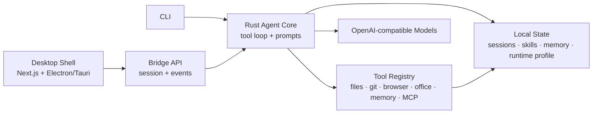

# Crab（螃蟹）

[English](README.md)


<p>
  <a href="https://github.com/matingai/crab/stargazers"></a>
  <a href="https://github.com/matingai/crab/releases"></a>
  <a href=".github/workflows/ci.yml"></a>
  <a href="LICENSE"></a>
  <a href="https://github.com/matingai/crab/commits/main"></a>
  <a href="https://github.com/matingai/crab/issues"></a>
  <a href="CONTRIBUTING.md"></a>
  <a href="Cargo.toml"></a>
  <a href="#项目状态"></a>
  <a href="docs/AGENT_LOOP.md"></a>
  <a href="docs/AGENT_LOOP.md#delegation-model"></a>
  <a href="docs/ARCHITECTURE.md#local-state"></a>
  <a href="docs/DESKTOP_PACKAGING.zh-CN.md"></a>
  <a href="#桌面壳"></a>
  <a href="#配置"></a>
  <a href="SECURITY.md"></a>
  <a href="ROADMAP.md"></a>
</p>

Crab（中文名：螃蟹）是一个受
[NousResearch/hermes-agent](https://github.com/NousResearch/hermes-agent)
启发的实验性 Rust agent 运行时与桌面壳项目。它不是原项目的逐行移植，而是把可复用的本地
agent 内核、显式工具注册表、工作区持久化状态，以及 Electron/Tauri 桌面集成作为主要目标。

当前仓库更适合作为 0.1.x 阶段的活跃原型：适合研究、扩展，或嵌入到本地编码/研究型 agent
产品中。

## 项目特色

Crab 的核心不是单一聊天界面，而是一个本地 agent runtime。CLI、桌面壳、工具、
memory、skills 和 bridge API 都建立在同一个 Rust 内核之上，因此它既可以作为独立助手使用，
也可以作为桌面应用后端，或嵌入到其他本地自动化界面中。

这个项目的特点包括：

- **Rust 原生 agent 内核**：工具循环、模型客户端、session 持久化、事件流和运行时配置都在 Rust
  中实现，而不是简单包一层脚本。
- **事件优先的桌面集成**：agent 执行过程会输出结构化 lifecycle、streaming、tool、approval 和
  completion 事件，前端可以直接订阅。
- **工作区感知上下文**：项目说明、子目录提示、session 状态、memory、skills、todos 和本地 runtime
  profile 都是一等 prompt 输入。
- **以目标状态为中心的思考**：主 agent 持续追踪当前目标、阻塞点、证据、风险、下一步和置信度，而不是把每个
  prompt 当成孤立聊天。
- **受控工具注册表**：内置工具有 schema、执行边界、approval hook 和面向模型的精简定义，而不是把所有能力退化成任意 shell。
- **面向委派的执行方式**：主循环可以把边界清晰的研究、验证、实现和文档生成任务交给 worker 或辅助模型，
  再把它们的发现合并回目标状态。
- **本地知识循环**：skills 和 memory 被当作可复用的 agent 能力，而不是静态笔记或 UI 附属数据。
- **文档与浏览器工作流**：运行时包含浏览器自动化、PDF 检查、Office 文档处理和 Slidev deck 支持，
  因此除了编码任务，也适合研究、资料整理和办公型 agent 工作流。
- **不绑定单一桌面技术栈**：当前 shell 可走 Electron，同时 bridge 和 Tauri 骨架让后端不依赖某一个前端运行时。

## 核心亮点

- 支持 OpenAI-compatible Responses API 和 Chat Completions API。
- 面向 UI 和桌面壳的流式事件模型。
- 工具调用循环已接入文件、Git、浏览器、PDF、Office、memory、skills、MCP、cron 和任务委派等能力。
- 会话当前默认持久化到兼容数据目录 `.hermes-agent-rs/`。
- 自动注入项目上下文文件，例如 `AGENTS.md`、`CLAUDE.md`、`.hermes.md`、`.cursorrules`
  和 `.cursor/rules/*.mdc`；工具触达嵌套路径时，还会按 root-to-leaf 发现目录级指令栈。
- 本地 memory 与 skills 系统采用“按需召回”，避免每轮请求塞入全部历史。
- 长会话场景下的上下文压缩与请求恢复机制。
- 桌面壳基于 Next.js + Electron，同时保留 Tauri 后端骨架。
- 可检查本地浏览器、Office 等运行时能力的 runtime profile。

## 架构概览



## 应用截图

以下截图使用 `scripts/capture-screenshots.mjs` 生成的演示数据。

| Agent 时间线 | 技能和应用 |
| --- | --- |
|  |  |

| 定时任务 | 运行设置 |
| --- | --- |
|  |  |

## 下载桌面 App

最容易试用 Crab 的方式，是直接从
[GitHub Releases](https://github.com/matingai/crab/releases) 下载桌面安装包。tagged
release 会在 GitHub 原生 runner 上构建，普通用户不需要本地安装 Rust、Node.js 或打包环境。

| 平台 | Release asset | 安装体验 |
| --- | --- | --- |
| macOS Apple Silicon | `crab-desktop-vX.Y.Z-aarch64-apple-darwin.dmg` | 打开 DMG，把 Crab 拖进 Applications。 |
| macOS Intel | `crab-desktop-vX.Y.Z-x86_64-apple-darwin.dmg` | 打开 DMG，把 Crab 拖进 Applications。 |
| Windows x64 | `crab-desktop-vX.Y.Z-x86_64-pc-windows-msvc-setup.exe` | 直接运行 setup 安装程序。 |

每个安装包都会同时发布同名 `.sha256` 校验文件和 `.json` manifest。当前 0.1.x 是未签名 preview
安装包，在接入代码签名和 notarization 之前，macOS Gatekeeper 或 Windows SmartScreen 可能会提示风险。
发布流水线和签名计划见 [桌面安装包文档](docs/DESKTOP_PACKAGING.zh-CN.md)。

## 延伸文档

- [Project Overview](docs/PROJECT_OVERVIEW.md)：项目定位与工程主张。
- [Architecture](docs/ARCHITECTURE.md)：runtime、bridge、tools、桌面壳与本地状态。
- [Agent Loop](docs/AGENT_LOOP.md)：目标状态推理、委派、工具证据和恢复机制。
- [Install Guide](docs/INSTALL.zh-CN.md)：源码安装、`cargo install`、provider 配置和桌面壳启动。
- [Quickstart](docs/QUICKSTART.zh-CN.md)：从安装、自检、无密钥 smoke test 到桌面预览的最短路径。
- [Examples](examples/README.md)：可用于演示的 coding、research、browser/PDF 和文档工作流。
- [FAQ](docs/FAQ.zh-CN.md)：无密钥试用、模型网关、安全边界和常见推广问题。
- [Demo Script](docs/DEMO_SCRIPT.md)：短视频/直播演示脚本。
- [Launch Kit](docs/LAUNCH_KIT.md)：项目定位、发帖文案、文章大纲和发布检查清单。
- [Promotion Playbook](docs/PROMOTION_PLAYBOOK.md)：推广节奏、渠道打法、社交文案、指标和质疑回应。
- [Future Vision](docs/FUTURE_VISION.md)：长期路线和未来畅想。
- [Open-source Privacy Review](docs/OPEN_SOURCE_REVIEW.md)：开源前隐私与仓库卫生检查。
- [Badges And Topics](docs/BADGES_AND_TOPICS.md)：仓库 tags、labels、badges 和社交预览建议。
- [Release Process](docs/RELEASE_PROCESS.md)：发布检查清单和版本策略。
- [Maintainer Guide](docs/MAINTAINER_GUIDE.md)：项目定位、issue triage、labels 和公开仓库卫生。

## 仓库标签

推荐 GitHub topics：

`rust` · `ai-agent` · `agent-runtime` · `agent-loop` · `tool-calling` · `local-first` ·
`desktop-agent` · `electron` · `tauri` · `openai-compatible` · `mcp` · `automation` ·
`developer-tools`

## Agent Loop 特色

agent loop 是这个项目真正的中心。Crab 把主 agent 设计成一个面向目标求解的控制模型，
而不是简单地把用户输入发给 LLM 再返回一段文本。主 agent 的职责是持续追踪用户目标，维护紧凑的工作状态，
判断下一步动作，在合适时委派边界清晰的任务，并把子模型或 worker 的结果整合回当前目标。

每一轮对话都会作为一个受控执行循环处理：组装上下文、调用工具、更新本地状态、处理模型或运行时限制，
并把结构化进度实时推给前端。

这个 loop 的设计重点包括：

- **目标追踪优先**：loop 会维护 goal state、阻塞点、证据、置信度、风险、hot data、todos 和 solve trace，
  让 agent 能跨很多轮持续判断进展，而不是每次只看最新 prompt。
- **主 agent 是调度者**：主模型主要负责问题框定、下一步选择、取舍判断、审批边界和结果综合。
- **委派给子模型/worker**：代码探索、验证、文档草稿、浏览器研究、替代方案搜索等边界清晰的子任务，
  可以交给 worker runs 或辅助模型完成，再读回结果并 reconcile 到目标状态。
- **先构建上下文，再执行动作**：每一轮都会重新组合项目说明、近期对话、召回的 memory、激活的
  skills、todos、goal state、runtime profile，以及可选的调试/上下文模块。工具进入嵌套目录时，
  目录级指令会按从根到叶子的顺序注入，越靠后的规则越具体。
- **工具调用是协议，不是裸 shell**：工具有 schema 和执行边界，返回结果会被摘要、分类并回写到对话、
  goal state、memory 和 solve trace，避免把无限增长的原始日志直接塞进历史。
- **长期任务有状态**：session、memory、todos、goal state、solve trace、archive、approval 和
  delegated runs 都会在本地持久化，方便跨轮次、跨桌面重启继续工作。
- **审批感知执行**：敏感操作可以暂停等待 approval，用户确认后再通过同一条 session/event 路径恢复。
  terminal 命令和 `execute_code` 片段共用同一套破坏性 shell 风险识别。
- **可配置工具策略**：`.env*`、`.ssh/*`、私钥等常见敏感路径默认受保护；本地配置还可以继续添加审批要求，
  或完全禁用指定工具/路径。
- **敏感信息感知的观察结果**：工具输出、实时预览、timeline 详情、archive 记录和已保存的 assistant
  tool-call 参数会在进入长期上下文前清洗常见 credential 形态。
- **保护未提交改动**：文件修改类工具默认拒绝覆盖、patch、删除或移动 Git 工作区里已有未提交改动的路径；
  只有工具调用显式传入 `allow_dirty` 时才会继续。
- **上下文压力处理**：loop 能识别 context overflow，压缩旧历史，调整输出预算，并用更稳妥的 prompt
  形态重试。
- **事件流是一等输出**：loop 会输出模型、工具、审批、委派、上下文和完成事件，桌面壳可以渲染实时执行时间线，
  而不是只等待最终回答。
- **扩展面统一接入**：内置工具、MCP tools、plugin hooks、bundled skills 和 delegation tools 都进入同一个
  loop，不是分散的一次性集成。

## 项目状态

本项目仍在活跃开发中。公开 API、桌面端行为、工具 schema 和本地数据格式在稳定版之前都可能继续变化。

重要安全说明：

- terminal 工具默认关闭，需要通过 `--enable-shell` 或 `HERMES_RS_ENABLE_SHELL=1` 显式启用。
  terminal 调用支持 1 到 300 秒的受限 `timeout_seconds` 参数。
- 浏览器、文件、Office、shell 相关工具会在本机执行。请只在可信工作区使用，并在敏感操作前审阅模型输出。
- `execute_code` 同样受 shell 开关约束；当 inline 或文件脚本里包含明显破坏性 shell 片段时，会先暂停等待
  approval。
- 本地 `tool_policy` 默认会在具体工具执行前保护 `.env*`、`.ssh/*`、`.aws/*` 和私钥文件等常见敏感路径；
  preflight 会递归检查 path-like 工具参数，包括嵌套数组和 camelCase key，因此复杂工具也走同一套护栏。
  你可以扩展这些规则，也可以在本地配置中显式关闭默认规则。
- 本地 `network_policy` 默认阻止直接 web-fetch 工具访问 loopback、内网、link-local 和 metadata 类 host。
  只有可信工作流确实需要时，才建议显式允许本地/内网 host。
- 运行时 redaction 是 best-effort，主要处理常见 key/token/password 格式，也覆盖 approval 请求展示字段；
  approval 匹配使用稳定哈希而不是展示出来的命令。它不能替代从源头避免把密钥写进 prompt 或生成文件。
- 在 Git 工作区中，文件修改类工具默认保护已有未提交改动的路径；只有确认要改动本地用户改动时，
  才应显式使用 `allow_dirty`。
- 本地 session、memory、日志、运行时数据库和 provider 配置应保存在被忽略的本地目录中。不要提交
  `.hermes-agent-rs/`、`.env`、生成的演示文档、生成的幻灯片或浏览器/session 产物。

## 仓库结构

```text
.
├── src/                         Rust agent 运行时与 CLI
│   ├── agent.rs                 工具调用循环与会话执行
│   ├── bridge.rs                前端/桌面桥接 API
│   ├── cli.rs                   命令行定义
│   ├── config.rs                运行时配置加载
│   ├── llm.rs                   OpenAI-compatible 模型客户端
│   ├── prompts.rs               系统提示与工作区上下文组装
│   ├── runtime_profile.rs       本地运行时能力解析
│   ├── skills.rs                本地 skill 发现与存储
│   └── tools/                   内置工具实现
├── bundled-skills/              随运行时分发的 skills
├── desktop-shell/               Next.js + Electron 桌面壳，包含 Tauri 后端脚手架
├── docs/                        发布与开源卫生检查说明
├── examples/                    可直接用于演示的工作流 playbooks
├── scripts/                     辅助脚本
├── Cargo.toml                   Rust package manifest
└── README.md                    英文文档
```

## 环境要求

- Rust 1.85 或更新版本，因为项目使用 Rust 2024 edition。
- 一个兼容 OpenAI Responses API 或 Chat Completions API 的模型 provider。
- 如果运行桌面壳，需要 Node.js 和 npm。
- 如果开发 Tauri shell，需要准备对应平台的 Tauri 依赖。

## 安装

tagged GitHub releases 会生成两类下载文件：

- 面向普通用户的桌面安装包：macOS `.dmg` 和 Windows NSIS setup `.exe`。
- 面向开发者和自动化环境的 CLI 压缩包：macOS/Linux `.tar.gz` 和 Windows `.zip`。

桌面安装包会同时发布同名 `.sha256` 校验文件和 `.json` release manifest。asset 名称、校验说明和
直接安装命令见 [安装 Crab](docs/INSTALL.zh-CN.md)。

安装最新版 macOS/Linux CLI：

```bash
curl -fsSL https://raw.githubusercontent.com/matingai/crab/main/scripts/install.sh | bash
```

从 GitHub 安装 CLI：

```bash
cargo install --git https://github.com/matingai/crab.git --locked
```

或者从本地 checkout 安装：

```bash
cargo install --path . --locked
```

验证安装：

```bash
crab --help
crab doctor
crab debug-context --prompt "Explain how Crab tracks goals and delegates work."
```

Provider 配置、桌面壳启动和排障见 [安装 Crab](docs/INSTALL.zh-CN.md)。

## 无密钥试用

你可以先查看 Crab 如何组装上下文，不需要真实请求模型：

```bash
cargo run -- doctor
cargo run -- debug-context --prompt "Explain how Crab tracks goals and delegates work."
```

`doctor` 会检查本地 workspace、runtime、provider 配置、shell 安全开关、release 脚本和可选工具链，
并且不会打印密钥。`debug-context` 会打印 system prompt、workspace context、goal-state digest、
memory snapshot、runtime profile 和工具定义。两者合起来，是配置 provider 之前最快看到 agent loop
形态的方式。

桌面预览可以运行：

```bash
cd desktop-shell
npm install
npm run dev
```

然后打开 `http://localhost:1420`，查看首次启动的 Agent Loop demo 态。

## 快速开始

先通过环境变量配置模型访问。默认模型可以用 `HERMES_RS_MODEL` 或 `--model` 覆盖。

```bash
export OPENAI_API_KEY="your-api-key"
export OPENAI_BASE_URL="https://api.openai.com/v1"
export HERMES_RS_MODEL="gpt-4.1-mini"
```

启动交互式会话：

```bash
cargo run -- chat
```

执行单次 prompt：

```bash
cargo run -- chat --prompt "Read Cargo.toml and summarize this project."
```

指定或恢复 session：

```bash
cargo run -- --session my-session-id chat
```

只预览本轮会发给模型的上下文，不真实请求模型：

```bash
cargo run -- debug-context --prompt "Explain the runtime architecture."
```

预览上下文后继续执行：

```bash
cargo run -- debug-context --prompt "Explain the runtime architecture." --execute
```

启用 terminal 工具：

```bash
cargo run -- --enable-shell chat
```

## CLI 命令

安装后的二进制命令名为 `crab`。

```text
chat               启动交互式会话或执行单次 prompt
debug-context      查看组装后的 prompt 上下文
doctor             检查本地配置、provider、安全开关和发布卫生状态
memory-compress    生成压缩后的 memory/session 摘要
profile            打印解析后的 runtime profile
runtime-status     检查本地 runtime 健康状态
runtime-start      启动或准备本地 runtime
runtime-repair     尝试修复本地 runtime
runtime-reset      重置本地 runtime 状态
desktop-bridge     启动桌面壳使用的 JSON bridge
```

全局参数包括 `--provider`、`--model`、`--base-url`、`--api-key`、`--workspace`、
`--data-dir`、`--session`、`--max-iterations` 和 `--enable-shell`。

出于安全考虑，建议优先使用环境变量或被 Git 忽略的本地配置文件，不要在命令行参数中直接传 API key。

## 配置

运行时会从 CLI 参数、环境变量和本地 data directory 中解析配置。在当前 0.1.x 兼容线中，
默认 data directory 为：

```text
<workspace>/.hermes-agent-rs
```

常用环境变量目前仍保留 `HERMES_RS_*` 兼容前缀：

| 变量 | 用途 |
| --- | --- |
| `OPENAI_API_KEY` | OpenAI-compatible provider 的 API key。 |
| `OPENAI_BASE_URL` | OpenAI-compatible endpoint 的 base URL。 |
| `HERMES_RS_PROVIDER` | 指定 provider id 或 provider profile。 |
| `HERMES_RS_MODEL` | 覆盖主模型。 |
| `HERMES_RS_DATA_DIR` | 覆盖本地 data directory。 |
| `HERMES_RS_SESSION_ID` | 恢复或固定 session id。 |
| `HERMES_RS_MAX_ITERATIONS` | 工具调用循环的最大迭代次数。 |
| `HERMES_RS_ENABLE_SHELL` | 设置为 `1`、`true`、`yes` 或 `on` 时启用 terminal 工具。 |
| `HERMES_RS_DEBUG_CONTEXT` | 写入上下文调试快照。 |
| `HERMES_RS_AUX_MODEL` | 为部分摘要路径指定辅助模型。 |
| `HERMES_RS_BROWSER_BACKEND` | 选择本地 browser tooling 的 backend。 |

也可以在 `.hermes-agent-rs/config.yaml` 中保存本地 provider 配置：

```yaml
model:
  provider: openai
  model: gpt-4.1-mini
  base_url: https://api.openai.com/v1
  # 推荐使用 OPENAI_API_KEY，而不是在这里保存 api_key。
```

仓库内置 skills 默认启用。测试、极简本地 store 或下游嵌入场景可以显式关闭：

```yaml
skills:
  include_bundled: false
```

本地工具策略默认保护 `.env*`、`.ssh/*`、`.aws/*`、`.gnupg/*`、私钥文件和常见 credential 配置文件。
策略 preflight 会递归检查 `path`、`source_path`、`output_path`、`save_as`、`filePaths` 等 path-like
工具参数，包括嵌套数组和对象。你可以扩展这些默认规则，也可以要求指定工具审批，或禁用指定工具/路径。
工具模式可以是精确工具名、`*`，或以 `*` 结尾的前缀通配；路径模式支持精确目录和 `*` 通配：

```yaml
tool_policy:
  # 默认值为 true。只有当你想完全自管路径策略时才建议设为 false。
  include_default_protected_paths: true
  require_approval:
    - terminal
    - execute_code
    - browser_*
  disabled:
    - browser_eval
  protected_paths:
    - .env*
    - .github/workflows/*
  disabled_paths:
    - secrets/*
```

直接 web-fetch 工具也会走本地网络策略。默认情况下，`web_extract` 会在发起请求前阻止 loopback、内网、
link-local 和 metadata 类 host。浏览器导航仍可用于有意的本地应用预览；这个护栏主要约束 runtime 自己发起的
server-side fetch：

```yaml
network_policy:
  # 默认值为 false。只有可信工作区确实需要时才设为 true。
  allow_private_network: false
  allowed_hosts:
    - localhost
  blocked_hosts:
    - "*.internal.example"
```

`.hermes-agent-rs/` 已被 Git 忽略。它是当前兼容运行时目录，未来 breaking release 可以再迁移为
Crab 命名。

## 桌面壳

桌面壳位于 `desktop-shell/`，渲染层使用 Next.js，并保留 Electron 与 Tauri 两条集成路径。

安装前端依赖：

```bash
cd desktop-shell
npm install
```

运行 Electron shell：

```bash
cd desktop-shell
npm run electron:dev
```

只运行 Next.js renderer：

```bash
cd desktop-shell
npm run dev
```

运行 Tauri shell：

```bash
cd desktop-shell
npm run tauri:dev
```

构建本地 Tauri 安装包：

```bash
cd desktop-shell
npm run package:desktop
```

macOS 下可以用 `npm run package:dmg` 在 `dist/` 生成 DMG；Windows 下可以用
`npm run package:exe` 生成 NSIS setup `.exe`。脚本还会同时写出 `.sha256` 和 `.json`
元数据。release asset 命名、签名说明和 CI 行为见
[桌面安装包文档](docs/DESKTOP_PACKAGING.zh-CN.md)。

检查 Tauri backend：

```bash
cargo check --manifest-path desktop-shell/src-tauri/Cargo.toml
```

## 内置工具范围

当前内置工具注册表覆盖：

- 工作区文件：list、read、search、write、patch、move、delete。
- Git 状态、diff、日志和分支操作。
- 浏览器导航、快照、截图、交互、抽取和图片发现。
- PDF 与 Office 文档的检查、预览、抽取和生成路径。
- session 搜索、archive 查询、memory 查询、memory digest 和 wiki-style notes。
- skills 列表、查看和管理。
- MCP 工具发现与调用，包括缓存后的动态 MCP tools。
- cron job 管理与 delegated worker runs。
- Slidev deck 创建与预览。
- 可选 terminal 执行。

工具可用性和具体行为会随运行时稳定继续演进。

## 开发

常用检查：

```bash
cargo fmt --check
cargo test
cargo check --manifest-path desktop-shell/src-tauri/Cargo.toml
```

前端检查：

```bash
cd desktop-shell
npm install
npm run build
```

当前仓库包含较多桌面端和运行时能力。建议保持改动聚焦，并针对触碰的模块运行对应检查，避免提交生成产物。

## 社区与项目健康度

- [Contributing Guide](CONTRIBUTING.md)：开发环境、PR 要求和隐私注意事项。
- [Security Policy](SECURITY.md)：安全问题私密报告方式和支持版本。
- [Support Guide](SUPPORT.md)：如何提问，以及什么样的报告更有帮助。
- [Code of Conduct](CODE_OF_CONDUCT.md)：社区行为规范。
- [Roadmap](ROADMAP.md)：当前优先级和长期方向。
- [Changelog](CHANGELOG.md)：公开变更历史。
- [Launch Kit](docs/LAUNCH_KIT.md)：可复制的公开传播文案和渠道计划。
- [GitHub issue templates](.github/ISSUE_TEMPLATE)：结构化 bug、feature 和 docs 反馈模板。

## 开源卫生检查

发布前请阅读 [docs/OPEN_SOURCE_REVIEW.md](docs/OPEN_SOURCE_REVIEW.md)。

当前 ignore 规则已经排除常见密钥和本地状态文件，包括 `.env`、`.hermes-agent-rs/`、桌面端 session
数据库、生成报告、生成幻灯片和构建产物。如果保留现有 Git 历史，要注意历史提交中仍然可能包含后来已经删除的文件。
为了更干净地公开发布，可以在审查后从全新仓库发布，或在确认后重写历史。

## Star History

[](https://www.star-history.com/?repos=matingai%2Fcrab&type=timeline&logscale=&legend=top-left)

## License

Crab 使用 [MIT License](LICENSE) 发布。
