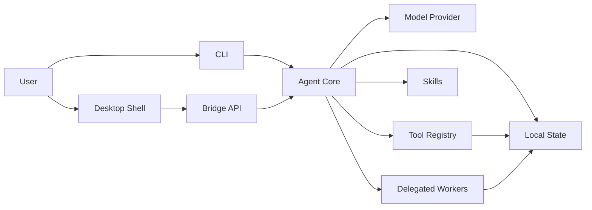

# Architecture

Crab is organized as a reusable Rust runtime with multiple surfaces around it.
The CLI and desktop shell are clients of the same core. Tools, skills, memory, sessions,
and delegated runs are part of the runtime rather than isolated UI features.

## High-level Shape



## Core Runtime

The Rust core owns the agent execution model:

- `src/agent.rs`: the main loop, context assembly, tool calls, retries, event emission, and
  state reconciliation.
- `src/llm.rs`: OpenAI-compatible request/response handling.
- `src/config.rs` and `src/providers.rs`: provider resolution and runtime configuration.
- `src/prompts.rs`: system prompt and project context assembly.
- `src/session.rs`: persisted conversation state.
- `src/events.rs`: structured event model consumed by CLI and desktop surfaces.

This keeps the agent behavior independent from any single UI.

## Bridge Layer

`src/bridge.rs` exposes the runtime as a frontend-friendly API. The bridge is responsible
for turning desktop requests into agent runs, session operations, provider inspection,
skill views, cron actions, delegated run management, and runtime status checks.

The important design choice is that the bridge is not merely a transport shim. It is the
stable boundary between a UI and the local agent runtime.

## Desktop Shell

`desktop-shell/` currently contains a Next.js renderer and Electron shell, while keeping
Tauri backend scaffolding in place. The desktop UI can subscribe to agent events and show
live execution rather than waiting for a final answer.

This matters because agent work is not a single message. It includes context construction,
tool calls, approvals, retries, worker delegation, file previews, browser state, and final
synthesis. The desktop shell gives those internal steps a visible shape.

## Tool Registry

Tools live under `src/tools/` and are registered through a central registry. The registry
provides:

- Tool schemas for model-facing calls.
- Execution dispatch.
- Condensed primary-model definitions for colder tools.
- Workspace path handling.
- Integration with plugins and cached MCP tools.
- A boundary for future policy and approval improvements.

Tool groups currently include file operations, Git, browser automation, Office/PDF
handling, memory, skills, MCP, cron, delegation, Slidev, archive/session search, and an
optional terminal tool.

## Local State

The runtime keeps state local by default. The workspace data directory currently uses the
legacy-compatible path:

```text
<workspace>/.hermes-agent-rs
```

This local state can include sessions, memory, skills, archive data, approvals, cron jobs,
goal state, solve traces, delegated run records, and runtime configuration.

The path keeps compatibility with the original prototype and may move to a Crab-named
directory in a future breaking release.

The design goal is not to store everything forever. The goal is to preserve the right
working state so the agent can continue a task with continuity instead of pretending every
turn is brand new.

## Skills And Memory

Skills and memory serve different purposes:

- Memory stores facts, preferences, prior findings, and reusable context that can be
  recalled when relevant.
- Skills store procedural knowledge: how to perform a workflow, which tools to prefer, and
  what activation conditions make the skill useful.

Both are intentionally local and inspectable. They are part of the agent's operational
surface, not hidden prompt magic.

## Delegation

Delegated runs let the main loop hand off bounded work. A delegated worker can explore a
code path, inspect a document, verify a hypothesis, or draft an artifact while the main
agent remains responsible for the overall goal.

The main agent should not become a pile of uncoordinated subagents. Delegation is useful
only when the main loop can read the result, extract evidence, update goal state, and
decide the next action.

## Why Rust

Rust gives the project a strong base for an agent runtime:

- Typed boundaries for events, tools, sessions, and bridge requests.
- Good performance for local file and state operations.
- Predictable deployment as a native binary.
- A better foundation for desktop integration and long-running local services.

The project still interoperates with web and desktop ecosystems, but the agent core itself
is not a script glued to a UI.
